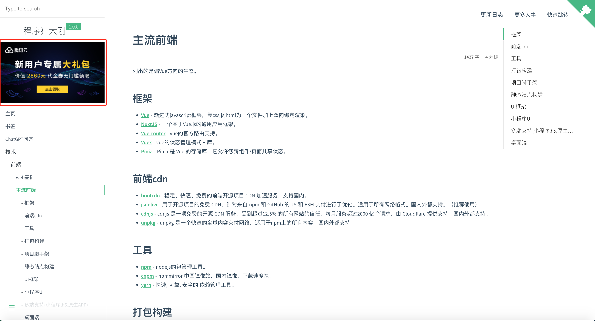

# docsify-ads
docsify plugin to show your ads!(定制你的广告)

[](https://www.npmjs.com/package/docsify-baidu-tj)



## Usage

1. Configure docsify-ads:(配置)

    ```html
    <script>
    window.$docsify = {
      // docsify ads 配置广告
      ads: [
        {
          img: 'https://dn-lego-static.qbox.me/cps/1638355965-480x300.jpg',
          href: 'https://s.qiniu.com/zqiMBz'
        },
        {
          img: 'https://dn-lego-static.qbox.me/cps/1638355965-480x300.jpg',
          href: 'https://s.qiniu.com/VJFJvi'
        },
        {
          img: 'https://dn-lego-static.qbox.me/cps/1638355799-480300.jpg',
          href: 'https://s.qiniu.com/7nM3uy'
        },
        {
          img: 'https://dn-lego-static.qbox.me/cps/1638268412-480x300.jpg',
          href: 'https://s.qiniu.com/VZvaii'
        },
        {
          img: 'https://dn-lego-static.qbox.me/cps/1638268217-480x300.jpg',
          href: 'https://s.qiniu.com/nMnaQj'
        },
        {
          img: 'https://dn-lego-static.qbox.me/cps/1638267917-480x300.jpg',
          href: 'https://s.qiniu.com/aqAneu'
        },
      }
    }
    </script>
    ```

2. Insert script into docsify document:

    ```html

    <!-- body -->
    <script src="https://unpkg.com/docsify-ads@1.0.4/dist/docsify-ads.min.js"></script>
    ```